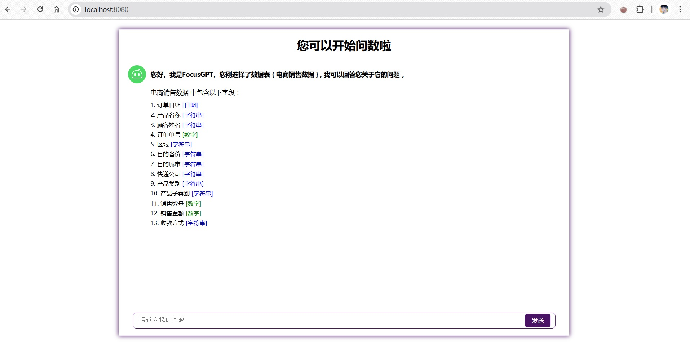

# FocusGPT DEMO

这是基于DataFocus API和datafocus-chart前端组件，搭建的一个可以实现多轮问数功能的DEMO。

需要node.js环境编译前端，和python后端环境。

# 实现思路
# 功能概述
用户通过一个简单的Web界面输入数据查询问题。

使用DataFocus API根据查询获取结果。参考文档[https://wiki.datafocus.ai/接口文档/自然语言查数据的接口文档(text%20to%20data).html]

使用前端组件渲染数据结果进行可视化。参考文档[https://www.npmjs.com/package/datafocus-chart]

# 技术栈
后端框架：使用Python的Flask框架，适合快速构建轻量级Web应用。

API调用：通过requests库调用DataFocus API 。

前端：Vue2。

# 准备工作

获取DataFocus API密钥。

使用环境变量存储API密钥，确保安全性。

运行脚本

```bash
start.bat
```



### 配置

可以指定环境变量DF_URL和DF_APP_TOKEN来配置DataFocus环境和APP_TOKEN信息，或是在server/config.py中直接指定

```python
# server/config.py
# Datafocus环境配置
DF_URL = os.getenv("DF_URL", "https://cloud001.datafocus.ai")
DF_APP_TOKEN = os.getenv("DF_APP_TOKEN", "NWIzZjg1OT********************************************************************lhMzMwNGE=")

```


