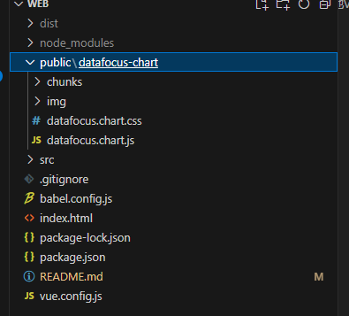
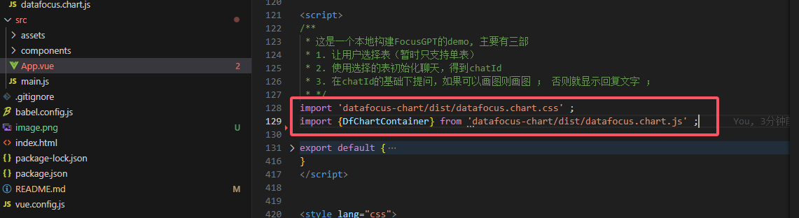

# 使用datafocus-chart组件在本地Vue2框架下使用说明

## 先安装datafocus-chart组件  

~~~
npm install datafocus-chart
~~~

使用文档 [https://www.npmjs.com/package/datafocus-chart]

## 在将node_modules下的datafocus-chart/dist文件夹复制到public文件夹下，并将dist修改为datafocus-chart如下

## 可以在项目中使用

